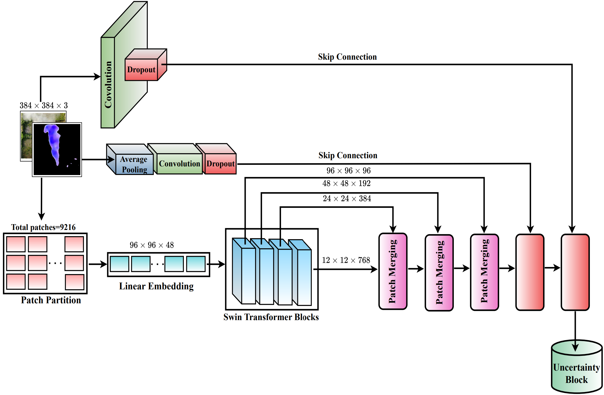
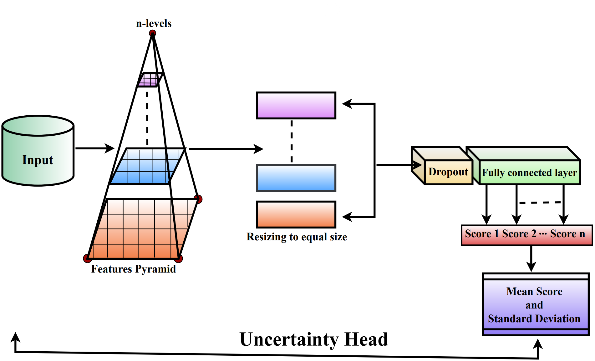

# Uncertainty Aware Shifted Window Transformer for Smoke Identification

**Authors:** Nitish Kumar Mahala, Muzammil Khan\*, Pushpendra Kumar

## Architectures  

<table>
    <tr>
        <td></td>
        <td></td>
    </tr>
    <tr>
        <td align="center"><strong>Figure 1:</strong> Architecture of the shifted window transformer for smoke detection.</td>
        <td align="center"><strong>Figure 2:</strong> Process of uncertainty head in shifted window transformer.</td>
    </tr>
</table>

## Download the Model
The trained model can be downloaded from [Google Drive](https://drive.google.com/file/d/1GEQM-tcE_J8mMrOuj0LAgYVPcspAsvho/view?usp=drive_link).

---

## Contact
For any questions or collaboration opportunities, reach out to:
- **Muzammil Khan** (Corresponding Author) – [m.khan@utwente.nl](mailto:m.khan@utwente.nl)
